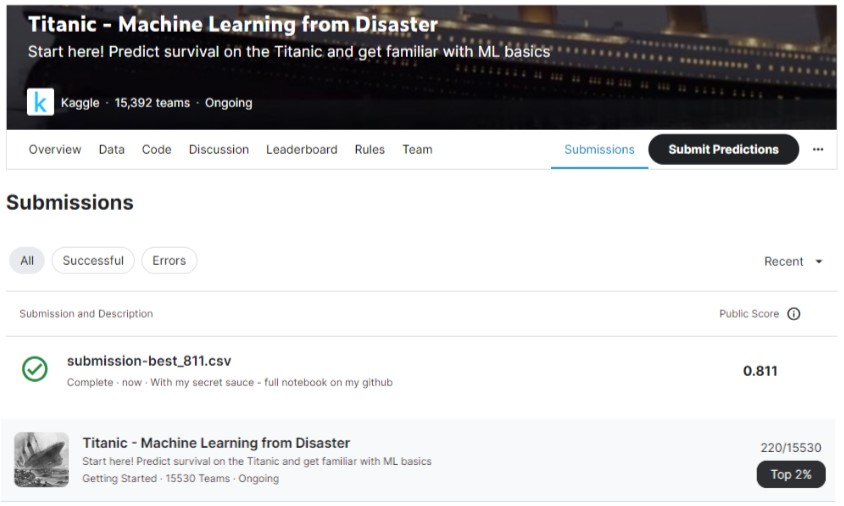

# Titanic Top 2% with Accuracy 81.1%
## My secret sauce to a top score in the Titanic competition

## Overview

My secret sauce to a top score in the Titanic competition: integrating numerous new tools and items of knowledge that I have obtained recently.

### The secret sauce is:

1. **Extensive feature engineering,** including target encoding, frequency encoding, regular expression, and more.

2. **Factor analysis and quantile transformation** of the numerical variables.

3. **Feature selection with Boruta Shap.**

4. **Handling the imbalanced dataset using SMOTE.**

5. **Utilizing Keras Classifier and tuning it with Keras tuner.** Yep, DNN rocks on tabular data.
